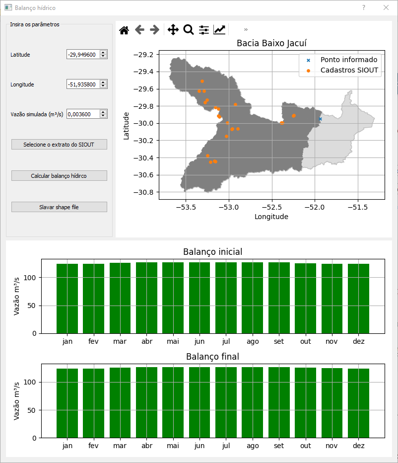

# balanco_hidrico
Uma alternativa ao balanço hídrico do SIOUT - RS.

## Dependências
    pip install geopandas matplolib pyqt5
   
## Instruções de uso

Dadas coordenadas de latitude e longitude, um extrato de siout e o valor da vazão simulada. O programa retorna uma mapa de localização da área de drenagem, ponto informado e processos no SIOUT em relação à bacia hidrográfica e os balanços hídricos iniciais e finais como mostrado nas imagens abaixo.

